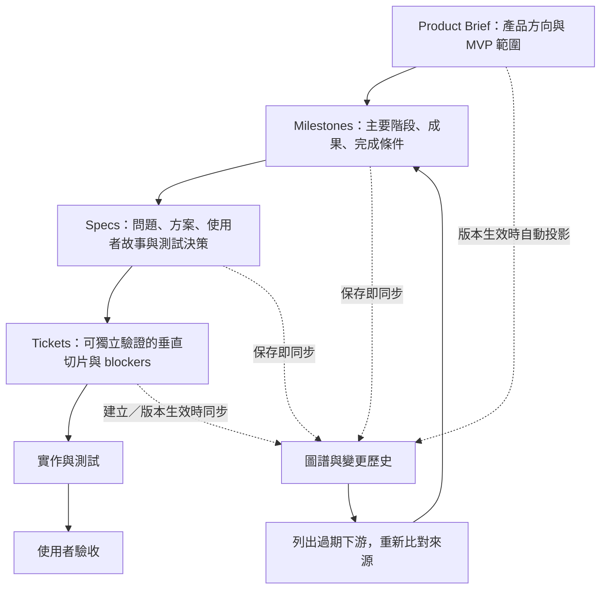

# 階層規劃與圖譜同步

目前流程為 **Product Brief → Milestone → Spec → Ticket → 實作 → 驗收**。規劃 skill 負責綜合內容，server 保證階層、版本、關係與保存的一致性。

| 層級 | 必須回答 | 正式來源 |
| --- | --- | --- |
| Product Brief | 為誰解決什麼問題，MVP 做到哪裡 | 使用者想法與目前核准版本 |
| Milestone | 主要完成階段、成果、順序、範圍、退出條件 | 一個 Product Brief 根節點 |
| Spec | 問題、方案、完整故事、實作及測試決策、排除範圍 | 一個 Milestone |
| Ticket | 本次端到端交付行為、驗收條件、blockers | 一個 Spec，連同完整 ancestry |

Spec 結構參考 `to-spec`；Ticket 以 `to-tickets` 的 tracer-bullet 垂直切片拆解，應能獨立展示、驗證且放入一次實作上下文。這些規劃內容保存在 SQLite；借用整理方法不代表自動發布 GitHub／Plane 工作項目。

## 操作

1. 以對話確認 Product Brief 的具體版本，呼叫 `approve_product_brief_version`。Core 同一 transaction 會新增或更新 `product_brief` 圖譜根節點，無第二次 graph approval。
2. `get_graph_context` 取得現在的 `graph_revision_id`。依主要階段用 `save_planning_node` 保存 Milestones，先展示階段邊界再往下拆。
3. 同一工具保存各 Spec，指定 `parent_node_id` 為 Milestone ID。Milestone／Spec 可在已授權規劃範圍內自主保存，無需額外核准。
4. 從 Spec 建立 Ticket drafts，`source_spec_id` 必填；server 自動加入 Spec、Milestone、Brief 三層 `related_graph_node_ids`。展現拆分、驗收與依賴，再依對話同意呼叫 `approve_ticket_revision`。
5. 使用既有實作及驗收 skills。只有 Result Acceptance 能讓 Ticket 完成；保存 Milestone／Spec 不代表階段已完成。

Product Brief、Ticket Revision、Implementation Brief 與 Result Acceptance 的使用者決策繼續沿用對話同意規則。取消的是規劃衍生圖譜的獨立核准；不會以圖譜更新推定產品驗收。

## save_planning_node

共用欄位為 `project_id`、`base_graph_revision_id`、`change`，所有操作都會檢查當前 base。完整 JSON 範例在 [skill 契約](../skills/ai-product-plan/references/planning-contract.md)。

`change.operation = save`：

- `title`、`document` 必填；更新用 `node_id`，新增時省略。
- `document.type` 為 `milestone` 或 `spec`。所有欄位嚴格驗證，不能更改既有節點 type、跨 Project 移動或復活已 archived identity。
- Milestone `content`：`outcome`、`exit_criteria`（至少一項）、`sequence`（正整數）、`scope`（至少一項）、`non_goals`。Parent 預設為 Brief 根節點。
- Spec `content`：`problem_statement`、`solution`、`user_stories`（至少一項）、`implementation_decisions`、`testing_decisions`（至少一項）、`out_of_scope`、`further_notes`。`parent_node_id` 必須為有效且來源未過期的 Milestone。
- 回傳 `node`、新的 `graph_revision`、`planning` 影響資訊。每次保存建立 Graph Revision 作為歷史紀錄；相同內容、標題及父歸屬的保存保留內容版本，可用來確認新上游仍適用。沒有來源待確認時不必重複保存。

`change.operation = archive` 只需 `node_id`：封存 Spec，或連同所屬 Specs 一起封存 Milestone，以及相關 active edges。Ticket identity 與舊 revision 仍保留，不能繼續用 archived 來源開始實作。回傳 `archived_node_ids`。

## 變更與過期來源

Milestone／Spec 的 `metadata` 包含完整 `content`、`parent_node_id`、`source_parent_revision_id` 與 `content_revision_id`。內容版本只在標題、描述、結構化內容或父歸屬改變時推進；`source_parent_revision_id` 指向父節點的內容版本，Brief 根節點則使用其 Graph Revision。`last_changed_in_graph_revision_id` 仍記錄每次保存，不與內容版本混用。`belongs_to` 是 child → parent。每次新增、修訂、移動或封存都在同一 transaction 保存 graph changes、Graph Revision、canonical nodes／edges、project pointers 與 audit；base 過期或驗證失敗整批回滾。

自動套用的 batch 為相容既有 storage 仍使用 `approved` 狀態，但 actor 為 `planning-automation`，audit 是 `graph_draft_batch.applied`／`applicationMode: automatic`，不假稱使用者做過圖譜核准。先前的 batch payload 與 revision 保留歷史，不增加另一套 Milestone／Spec tables。

`get_graph_context` 與保存結果的 `planning` 包含：

- `root_node_id`：目前 Brief 的穩定圖譜 identity。
- `stale_node_ids`：上游版本變動、需要重新比對的 Milestones／Specs。
- `affected_ticket_ids`：目前已核准、但引用來源變動的 Tickets。這是影響清單，不是自動重新開啟或撤銷驗收。

變更 Brief 會更新根節點並讓舊 Milestones／Specs 來源過期；變更 Milestone 內容會讓舊 Specs 過期。必須從上游往下重新比對：內容仍適用時保存相同內容以確認新來源；父節點內容版本未變時，不必再保存其下游。只有 Spec 內容版本、父歸屬或額外引用來源真正改變，使 Ticket 仍 stale，才建立 replacement Ticket Revision。相依 Ticket 的來源問題仍會向依賴者傳遞。

例如新增「戰績」並擴充原 Milestone 後，原「單局遊戲」Spec 在重新確認前仍阻擋 handoff／新結果接受。確認它仍完整適用、保存相同內容後，原 Ticket Revision、Brief、候選 Result 與既有 Acceptance 可沿用；新功能另建 Spec／Ticket。這不會重寫歷史或自動接受新 Result。若 Spec 真的修改，即使日後改回原文，內容版本仍已前進，不能復活舊 handoff。

內容相等採用結構化 JSON 比較（忽略 object key 順序、保留 array 順序），不猜測不同文字語意等價。舊節點缺少 `content_revision_id` 時沿用最後 Graph Revision；第一次相同內容保存會保留此版本，不回推或修復先前已被替代的交付歷史。

`get_graph_context` 另回傳 `delivery`：`summary` 包含 total、done、stale、blocked、awaiting_acceptance；`tickets` 列出來源問題、dependency IDs、阻擋工作的 dependency IDs、下一步與各 target 的 accepted／pending Result IDs、缺證據及未滿足的 criterion IDs。`scope: active_project_tickets` 表示全專案 active Tickets，不受 graph nodes 的查詢 filter 縮限。done 與 stale 可以同時成立，表示保留歷史完成狀態但需重新比對來源；查詢不修改驗收。證據檢查只確認引用完整性，不能取代使用者對證據是否足以支持條件的判斷。

Ticket → Spec 投影在首次 Ticket draft 建立時可見；replacement draft 不改寫目前核准的關係，直到 Ticket revision approval 才套用。該 edge 記錄來源 Graph Revision，並在 metadata 記錄建立它的 Ticket Revision；Ticket lifecycle 本身不推進產品意圖 Graph Revision。

## 相容與範圍

Core 為 23 個 tools；full 為 43 個 tools，保留手動 graph batch tools 與六個舊 prompts，並提供新的規劃入口。舊手動 graph tools 不能修改新階層的節點或關係，必須使用 `save_planning_node`。

既有 SQLite 無需重建：節點 type、metadata、Graph Revision 與 batch 變更紀錄可直接保存此階層。啟動不會猜測舊 tickets 的 Milestones／Specs；未採用階層的舊專案可繼續走 full。第一次保存 Milestone 可建立 Brief 根節點，之後新 Ticket 與 replacement revisions 必須來自 Spec。原有已核准 Ticket 與歷史仍可讀取；採用階層後，尚未補上 Spec ancestry 的 legacy Tickets 會出現在 affected 清單，handoff／新結果接受以 `planning_source_missing` 阻擋，避免 Brief 根節點自動同步掩蓋缺少來源。若要將既有規劃納入階層，先明確整理 Milestones／Specs，再將舊 Ticket 以新 revision 指向 Spec。

此次不增加外部同步、GitHub 自動發布、Milestone 自動完成或下一階段 roadmap。MVP 完成後暫停的要求仍有效。
